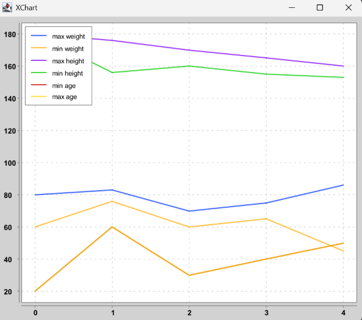

```java

        // Example utilization

        // ---- Dataset initialization ----
        List<Person> people = Arrays.asList(
                new Person(20, 180, 60),
                new Person(60, 156, 76),
                new Person(30, 160, 60),
                new Person(40, 155, 75),
                new Person(50, 153, 86),
                new Person(20, 180, 80),
                new Person(40, 165, 65),
                new Person(50, 160, 45),
                new Person(30, 170, 70),
                new Person(60, 176, 83)
        );


        // ---- Series Example ----
        
        // Collect people into a Series
        Series peopleAge = people.stream().collect(Series.collector(Person::getAge));


        // ---- Statistics ----

        double averageAge = peopleAge.mean();
        double minAge = peopleAge.min();
        double maxAge = peopleAge.max();


        // ---- Dataframe Example ----
        
        // Collect people into a Dataframe
        Dataframe df = people.stream()
                .collect(
                        Dataframe.<Person>collector()
                                .addColumn(HEIGHT, Person::getHeight)
                                .addColumn(WEIGHT, Person::getWeight)
                                .addColumn(AGE, Person::getAge)
                );
        
        
        // Print dataframe statistics
        df.printStatistics();


        // ---- Sorting ----


        Sorter sorter = new Sorter();

        Dataframe sortedDataframe = sorter.sortByColumn(AGE, true).sort(df);

        Dataframe shuffledDataframe = sorter.shuffle().sort(df);


        // ---- Grouping ----

        Grouper grouper = new Grouper();

        Map<Object, Dataframe> groupedByAge = grouper.groupByColumnValues(AGE).group(df);

        Map<Object, Dataframe> splits = grouper.split(3).group(df);


        // ---- Aggregation ----

        // Aggregates columns "weight", "height" and "age" into their min and max values
        Aggregator aggregator = new Aggregator()
                .addAggregation(WEIGHT, "max weight", Series::max)
                .addAggregation(WEIGHT, "min weight", Series::min)
                .addAggregation(HEIGHT, "max height", Series::max)
                .addAggregation(HEIGHT, "min height", Series::min)
                .addAggregation(AGE, "min age", Series::min)
                .addAggregation(AGE, "max age", Series::max);

        Map<String, Double> aggregation = aggregator.aggregate(df);


        Dataframe groupByAgeAggregated = aggregator.groupAggregate(
                df,
                grouper.groupByColumnValues(AGE)
        );


        // ---- Plotting ----

        Plotter plotter = new Plotter();

        plotter.line(groupByAgeAggregated);
```


